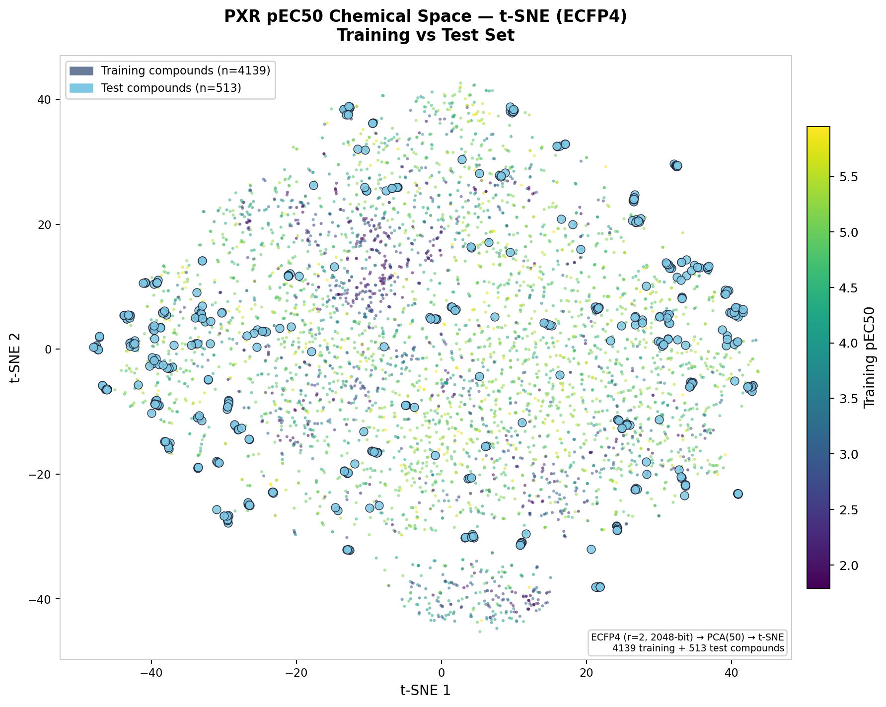

# Predicting PXR Induction Potency — OpenADMET Blind Challenge

> **Phase 1 result:** MAE **0.4468** · RAE **0.5606** · R² **0.5459** · Spearman **0.8463** · Kendall's τ **0.6567** · Rank **39**  
> 3-model ensemble · Chemprop D-MPNN + UniMol 3D transformer · No proprietary data

---

## Table of Contents

1. [Why PXR?](#why-pxr)  
2. [The Challenge](#the-challenge)  
3. [Data: From Screen to Model-Ready Set](#data-from-screen-to-model-ready-set)  
4. [Chemical Space Analysis](#chemical-space-analysis)  
5. [Models](#models)  
6. [What Was Tried (and What Failed)](#what-was-tried-and-what-failed)  
7. [Best Ensemble](#best-ensemble)  
8. [Conclusion](#conclusion)  
9. [Repo Contents](#repo-contents)  

---

## Why PXR?

The **Pregnane X Receptor (PXR / NR1I2)** is a nuclear receptor that acts as the primary sensor for foreign chemicals entering the body. Upon activation by a drug candidate, PXR translocates to the nucleus and dramatically upregulates **CYP3A4** — the cytochrome P450 enzyme that handles roughly half of all small-molecule drugs in clinical use. For a drug candidate, PXR activation carries three serious consequences:

| Consequence | Mechanism |
|---|---|
| **Drug-Drug Interactions (DDIs)** | Elevated CYP3A4 activity accelerates clearance of co-administered drugs, potentially dropping them below therapeutic thresholds |
| **Hepatotoxicity** | Increased metabolic flux through CYP3A4 can generate reactive intermediates that damage liver tissue |
| **Chemoresistance** | In PXR-expressing tumours, enhanced CYP3A4 activity reduces the intracellular concentration of oncology agents |

Modelling PXR activity is challenging for two reasons. First, the receptor's ligand-binding pocket is exceptionally large and conformationally adaptable, allowing it to accommodate structurally unrelated compounds — from macrolide antibiotics to steroidal natural products to synthetic drug fragments. Second, before this challenge, quantitative PXR activity data in the public domain was sparse and heterogeneous: fewer than 800 reliable pEC50 values extracted from roughly 150 publications, each using different cell lines, reporter constructs, and concentration protocols.

---

## The Challenge

The **<a href="https://huggingface.co/spaces/openadmet/pxr-challenge" target="_blank" rel="noopener noreferrer">OpenADMET Blind Challenge</a>** (Octant Bio + UCSF) addresses this data scarcity directly by releasing the largest uniform-assay PXR activity dataset to date: over 11,000 compounds tested in a single, standardised cell-based system.

**Assay design:** PXR agonism is measured using a reporter cell line in which a chimeric receptor construct — the PXR ligand-binding domain grafted onto a heterologous DNA-binding domain — drives luciferase expression upon activation. A critical feature of the assay is the paired counter-screen: an identical experiment is run in parallel using a construct carrying a non-functional point mutant of the same chimeric receptor. Any compound that activates both the active and mutant constructs is classified as a non-specific transcriptional activator (e.g. an HDAC inhibitor) rather than a genuine PXR agonist, and is removed from the potency analysis. Only compounds that selectively activate the functional construct are retained.

**The test set is not a random sample.** Rather than drawing compounds at random from the screening library, 513 Enamine on-demand analogs were selected around the 63 most potent and selective hits (ECFP4 Tanimoto similarity > 0.4 to at least one of the 63 seed compounds). This **analog expansion design** places the prediction task squarely in lead optimisation territory — small structural changes within active series that may produce large potency differences — rather than in broad virtual screening.

| Phase | Dates | Description |
|---|---|---|
| **Phase 1** | April 1 – May 25, 2026 | Blind prediction for all 513 test compounds; live leaderboard |
| **Phase 2** | May 26 – July 1, 2026 | Analog Set 1 labels unblinded; refine predictions for Set 2 |

**Metric:** Mean Absolute Error (MAE) on pEC50 (primary); RAE, R², Spearman ρ also reported.

---

## Data: From Screen to Model-Ready Set

### The generation funnel

```
Primary screen (11,362 compounds @ 10 µM / 30 µM)
    ↓  Hit rate ~17% @ 10 µM
Dose-response curves (4,325 compounds, 8-concentration)
    ↓  Fitted EC50 ≤ 1 µM
~211 active compounds (pEC50 ≥ 6)
    ↓  Counter-screen: selectivity_delta ≥ 1.5 log-units
63 selective hits → Enamine analog expansion → 513 test compounds
```

The competition released **4,139 compounds with pEC50 labels** as training data. Each has both a PXR pEC50 and a counter-screen pEC50, giving a **selectivity delta**:

```
selectivity_delta = pEC50(PXR) − pEC50(counter-screen)
```

### Finding the right training set

This was the most consequential decision in the project. Every threshold was tested systematically using Chemprop (D-MPNN + 61 RDKit descriptors) as the evaluation model, with all leaderboard results from blind test set submissions:

| Dataset | Compounds | Filter | LB MAE | RAE | R² | Spearman ρ | Verdict |
|---|---|---|---|---|---|---|---|
| `clean_train.csv` | 2,948 | delta > 1.5 | 0.4794 | 0.6017 | 0.4799 | 0.8042 | Starting point |
| **`clean_train2.csv`** | **3,743** | **delta > 0** | **0.4622** | **0.5800** | **0.5117** | **0.8137** | ✅ **FINAL** |
| + 37 ChEMBL compounds | 3,780 | delta > 0 + external | 0.5051 | 0.6338 | 0.4094 | 0.7420 | ❌ Assay heterogeneity |
| Relaxed (delta ≥ −0.6) | 4,054 | — | 0.4809 | 0.6036 | 0.5008 | 0.8097 | ❌ Non-selective compounds contaminate |
| Unfiltered | 4,139 | None | 0.5095 | 0.6397 | 0.4799 | 0.8025 | ❌ Rejected |

**The biological logic:** The 513 test compounds are analogs of hits with selectivity delta ≥ 1.5. The training set that best represents this population is one filtered by *positive* selectivity — delta > 0 captures compounds that show some PXR preference over the counter-screen, without forcing the strict 1.5-unit threshold that would discard useful potency information from moderate hits.

> **Rule established:** `clean_train2.csv` (3,743 compounds, selectivity_delta > 0) is the hard ceiling. Adding *any* compounds beyond this — by relaxing the filter, hand-picking borderline entries, or adding external ChEMBL data — degraded leaderboard performance in every single experiment. The boundary is not arbitrary: it reflects where the training distribution starts to diverge from the analog-expansion test set.

### Why external ChEMBL data hurt

37 ChEMBL PXR compounds with ECFP4 Tanimoto ≥ 0.4 to blind test compounds were curated and added to training. Leaderboard MAE jumped from 0.4622 to **0.5051** (rank 36 → 80). The reason: ChEMBL PXR measurements span at least 150 different assay protocols, cell lines, and reporter constructs accumulated over two decades. The OpenADMET assay is a single, tightly controlled protocol. Adding cross-assay data introduces systematic offsets that the model learns as real signal — but they are assay artefacts.

---

## Chemical Space Analysis

### Structural coverage of the test set

Prior to model development, the relationship between training and test chemical space was mapped using Morgan fingerprint Tanimoto similarity against `clean_train2.csv` (3,743 compounds). This is consistent with the challenge design: the 513 test compounds are Enamine analog expansions of the top 63 training hits, so structural coverage is expected to be high. The mean max-Tanimoto across all test compounds is **0.53**, peaking squarely in the 0.45–0.55 range.

**The challenge here is not structural novelty — it is activity cliffs and potency tail prediction.** The best Chemprop model produced a test prediction ceiling of **pEC50 = 5.94**, while the training set reaches **7.55**. Only 64 of 3,743 training compounds (1.7%) have pEC50 ≥ 6 — the model has very few high-potency scaffold anchors to extrapolate from, even when test compounds are structurally similar to training.

### Interactive Chemical Space Map (t-SNE)

A t-SNE embedding of all 4,652 compounds (training + test) was computed using:

```
ECFP4 fingerprints (2048-bit)
    → PCA (50 components)
    → t-SNE (perplexity=50, 500 iterations, PCA init)
```

**<a href="https://gashawmg.github.io/PXR-activity-pEC50-prediction/tsne_interactive_v2.html" target="_blank" rel="noopener noreferrer">→ Open interactive t-SNE map</a>**  
*(Hover over any compound to see its name and predicted pEC50. Viridis colour scale = training pEC50. Blue circles = test compounds.)*



**Key insight from the t-SNE:** Test compounds overlap well with training clusters throughout the chemical space. The prediction difficulty is concentrated in **potency extrapolation** — predicting fine-grained pEC50 differences within structurally similar analog series — not in structural coverage.

---

## Models

### Preliminary: Classical ML Baseline (RDKit Descriptors + ECFP4 + Meta-Learner)

Before building any deep learning pipeline, a classical ML stack was evaluated to establish a competitive baseline. Three models were trained on a combined feature set of RDKit physicochemical descriptors and ECFP4 fingerprints, stacked via a meta-learner:

- **LightGBM (LGBM)** — gradient boosting on bit-vector fingerprints
- **HistGradientBoosting (HGB)** — sklearn's histogram-based boosting
- **Support Vector Regression (SVR)** — RBF kernel

| Metric | Internal Test | Leaderboard |
|---|---|---|
| MAE | 0.500 | 0.5196 |
| RAE | n/r | 0.6526 |
| R² | 0.67 | 0.457 |
| Spearman ρ | n/r | 0.7258 |
| Kendall's τ | n/r | 0.5280 |
| **Rank** | n/r | **~36 (at submission time)** |

*n/r = not recorded at the time of the experiment.*

The leaderboard MAE of **0.5196** was 16% worse than the final deep learning ensemble (0.4468). More telling is the Spearman drop: 0.7258 vs 0.8463 — classical ML struggled to rank compounds correctly within analog series, which is precisely the activity cliff problem that graph neural networks handle better through learned structural representations.

This result established that RDKit descriptors + ECFP4 fingerprints + classical ML had hit a ceiling and motivated the switch to Chemprop D-MPNN and UniMol.

### Chemprop (2D Message-Passing Neural Network)

<a href="https://github.com/chemprop/chemprop" target="_blank" rel="noopener noreferrer">Chemprop</a> implements a directed message-passing neural network (D-MPNN) that learns molecular representations by iteratively aggregating atom and bond features across 2D graph neighbourhoods. The development of the final Chemprop model followed three successive improvements, each reducing MAE and RAE in a measurable, interpretable way.

**Step 1 — Graph topology alone is insufficient.** The first Chemprop model (v4_1) was trained on 2,948 compounds using molecular graph features only. Despite the architectural superiority of D-MPNN over classical ML, this model performed *worse* than the RDKit+ECFP4 baseline:

| Metric | Classical ML baseline | Chemprop v4_1 (no descriptors) |
|---|---|---|
| LB MAE | 0.5196 | 0.5289 |
| RAE | 0.6526 | 0.6641 |
| R² | 0.457 | 0.4183 |
| Spearman ρ | 0.7258 | 0.7324 |

The result demonstrates a key property of PXR: its unusually large and flexible ligand-binding pocket means that activity is governed as much by bulk physicochemical properties (lipophilicity, shape, polarity) as by precise 2D topology. A graph network that only sees atom connectivity cannot recover these features from structure alone.

**Step 2 — Domain-informed descriptors break the ceiling.** 61 PXR-specific physicochemical descriptors were computed via RDKit and concatenated to the graph-level representation at the readout layer:

- Lipophilicity & polarity: LogP, TPSA, polar surface ratio, MolMR
- Shape: Kappa1/2/3, NPR1/NPR2, Asphericity, FractionCSP3
- Rings: fused ring count, aromatic/saturated/aliphatic ring counts, steroid scaffold score
- PXR-relevant pharmacophores: sulfoxide count, ketone count, hydroxyl, Michael acceptors, electrophilic sp² centres
- Drug-likeness: QED, HBA, HBD, rotatable bonds, TPSA, Labute ASA

The effect on the same 2,948-compound training set was substantial:

| Metric | No descriptors | + 61 descriptors | Δ |
|---|---|---|---|
| LB MAE | 0.5289 | 0.4794 | ↓ 0.050 (−9.4%) |
| RAE | 0.6641 | 0.6017 | ↓ 0.062 (−9.4%) |
| R² | 0.4183 | 0.4799 | ↑ 0.062 |
| Spearman ρ | 0.7324 | 0.8042 | ↑ 0.072 |
| Kendall's τ | 0.5405 | 0.6143 | ↑ 0.074 |

A 9.4% simultaneous reduction in both MAE and RAE from a single feature engineering step is the largest single-step gain in the entire project. Explicit encoding of lipophilicity, molecular shape, and pharmacophore counts provides the model with the physicochemical language PXR uses to recognise ligands — information that 2D graph topology cannot recover on its own.

**Step 3 — Expanding the training set with biologically coherent compounds.** Relaxing the selectivity filter from delta > 1.5 to delta > 0 added 795 compounds to the training set (2,948 → 3,743). Combined with tuned hyperparameters (MSE loss, RobustScaler, 10-fold activity-stratified scaffold CV, 1/MAE fold weighting), this yielded the final v4_3_3 configuration:

| Metric | v4_1 + descriptors (2,948) | v4_3_3 (3,743) | Δ |
|---|---|---|---|
| LB MAE | 0.4794 | 0.4622 | ↓ 0.017 (−3.6%) |
| RAE | 0.6017 | 0.5800 | ↓ 0.022 (−3.6%) |

**CV fold count sensitivity.** Fold counts of 10, 15, and 20 were evaluated on the 3,743-compound set:

| Folds | Val set/fold | LB MAE | RAE |
|---|---|---|---|
| **10** | ~374 | **0.4622** | **0.5800** ✅ |
| 15 | ~250 | 0.4702 | 0.5903 ❌ |
| 20 | ~187 | 0.4750 | 0.5963 ❌ |

Smaller validation sets destabilise early stopping — the model terminates too early or too late based on noise, producing inconsistent fold quality and degraded ensemble performance.

**The cumulative Chemprop journey:**

| Stage | LB MAE | RAE | Δ MAE vs start |
|---|---|---|---|
| D-MPNN, no descriptors (2,948) | 0.5289 | 0.6641 | — |
| + 61 PXR descriptors (2,948) | 0.4794 | 0.6017 | ↓ 0.050 |
| + expanded training set (3,743) + tuning | **0.4622** | **0.5800** | ↓ 0.067 (−12.7%) |

Each improvement was independently motivated by domain knowledge and validated on the blind leaderboard, not on cross-validation alone.

### UniMol (3D Molecular Transformer)

<a href="https://github.com/deepmodeling/Uni-Mol" target="_blank" rel="noopener noreferrer">UniMol</a> is a transformer-based molecular foundation model pre-trained on three-dimensional atomic coordinates rather than 2D bond graphs. Input conformers are generated using the ETKDG v3 algorithm with all hydrogens retained, giving the model access to inter-atomic distances, angles, and steric contacts that 2D message-passing architectures cannot observe.

- **Pretraining:** 200 million molecular conformers (UniMol v2, 84M parameters)
- **Fine-tuning:** 3,743 competition compounds, 8-fold scaffold CV on Kaggle T4 × 2 GPU
- **LB MAE: 0.4615 (Rank 33), Spearman: 0.8306**

The same degradation pattern with fold count appeared: UniMol 12-fold (OOF MAE 0.3326 vs LB MAE 0.4788) showed an extreme train-test gap — a clear overfitting signal. 8-fold was the sweet spot for this dataset size.

---

## What Was Tried (and What Failed)

This section documents every significant experiment, because understanding what *doesn't* work is as important as the final result.

*\* Classical ML was submitted earlier in the competition when fewer teams had submitted; current equivalent rank would be significantly lower given the final leaderboard standings.*

### The core challenge: OOF MAE is not a reliable guide

The most important methodological finding was a consistent pattern: **every technique that improved out-of-fold (OOF) cross-validation MAE worsened the leaderboard MAE**. This reflects a fundamental distribution shift — the training set (filtered by selectivity delta) is not representative enough of the analog-expansion test set to use OOF as a reliable proxy for generalisation.

| Experiment | OOF MAE | LB MAE | Rank | Key lesson |
|---|---|---|---|---|
| Classical ML (LGBM+HGB+SVR meta-learner) | n/r | 0.5196 | ~36* | ❌ RDKit descriptors + ECFP4 hit a ceiling — motivated switch to GNNs |
| v4_3_3 MSE baseline | 0.4420 | 0.4622 | 36 | ✅ Hard ceiling |
| MAE/L1 loss (v4_3_4) | 0.4369 ↓ | 0.4674 ↑ | 62 | Better OOF, worse LB — MAE loss median-pulls |
| QuantileTransformer scaler (v4_3_5) | 0.4546 | 0.4748 | 68 | Poor convergence (avg 24 vs 41 epochs) |
| SC binary pre-training (v4_3_6) | **0.4338** ↓ | **0.4943** ↑ | **108** | Worst experiment — see below |
| Hand-picked +5 compounds | 0.4396 ↓ | 0.4751 ↑ | 67 | OOF/LB gap = 0.036 — largest observed |
| + 37 ChEMBL compounds | 0.4463 | 0.5051 | 80 | Assay heterogeneity |
| Piecewise stretch post-processing | n/r | always worse | n/r | Compression is distributional, not calibrational |

### The SC pre-training experiment (v4_3_6) — a cautionary tale

The competition provides `single_concentration.csv`: 21,003 measurements (10,870 unique SMILES) from the primary PXR screen with binary hit/non-hit labels (criterion: log2_fc > 1 AND FDR-adjusted p < 0.05). The hypothesis was that pre-training an MPNN binary classifier on this data, then transferring the message-passing weights into a regression fine-tuning run, would give the model prior knowledge of PXR-relevant structural features.

The results were sobering:

| Metric | SC pre-train | Baseline | Change |
|---|---|---|---|
| OOF MAE | 0.4338 | 0.4420 | ↓ Better |
| OOF R² | 0.7024 | ~0.51 | ↑ Suspicious jump |
| **LB MAE** | **0.4943** | **0.4622** | **↑ Much worse** |
| **LB Rank** | **108** | **36** | **↓ 72 places** |

Three root causes:

1. **Wrong training objective.** Binary hit/non-hit at 1–99 µM concentrations teaches the model to recognise "binder vs non-binder" — a coarse distinction. pEC50 regression requires learning *how potent* a binder is, which is a fundamentally different and more nuanced signal. Pre-training encodes the wrong gradient.

2. **Weight conflict during fine-tuning.** The transferred message-passing weights create a prior that fine-tuning must overcome. Best epoch per fold: [17, 49, 9, 29, 48, 10, 22, 33, 22, 14] — extreme variance. Some folds stop at epoch 9–10 before the prior is properly overridden; others run 48–49 epochs trying to fight it. Inconsistent fold models → poor ensemble quality.

3. **OOF R² jump 0.51 → 0.70 is an overfitting signature.** The model fits the training distribution better but the learned features don't generalise to blind test scaffolds.

> The right way to use SC data is **multi-task learning**: train a single MPNN simultaneously on pEC50 regression AND binary SC hit classification, with joint gradient flow through the shared encoder. All tasks update the message-passing weights together throughout training, rather than sequentially. This is on the Phase 2 agenda.

---

## Best Ensemble

The final best submission is a weighted average of three models:

| Model | Weight | Training data | Folds | LB MAE | RAE | R² | Spearman ρ |
|---|---|---|---|---|---|---|---|
| UniMol 8-fold (Kaggle T4 × 2) | **35%** | 3,743 compounds | 8 | 0.4615 | 0.5793 | 0.5515 | 0.8306 |
| Chemprop 10-fold | **35%** | 3,743 compounds | 10 | 0.4622 | 0.5800 | 0.5117 | 0.8137 |
| UniMol 7-fold† | **30%** | 1,948 compounds | 7 | 0.4647† | 0.5831† | 0.5163† | 0.8235† |

*† Leaderboard result is from a two-model blend submission (UniMol 7-fold + UniMol 10-fold), not a standalone submission of the 7-fold model alone.*

The third model — UniMol fine-tuned on the smaller 1,948-compound set — was retained despite training on less data because it captures structurally different error patterns from the 8-fold model (Pearson r = 0.937 between them; r = 0.922 between UniMol-8f and Chemprop). All pairwise correlations remain below 0.95, the practical threshold for meaningful ensemble benefit. A model trained on a different data subset introduces complementary variance that reduces the ensemble's overall error beyond what any single model achieves alone.

An unexpected but instructive detail: this model is the product of an incomplete training run. The fine-tuning script was executed locally and crashed after completing 7 of the intended 10 folds. Rather than restarting, the resulting 7-fold ensemble was submitted — and it outperformed the subsequently completed 10-fold run on Kaggle GPU infrastructure. This reinforces the fold count sensitivity finding from the Chemprop experiments: with ~1,948 training compounds, a 10-fold split yields only ~195 compounds per validation set, too few for reliable early stopping. The 7-fold configuration (~278 compounds per fold) maintained sufficient validation stability to produce better-generalising fold models.

### Phase 1 leaderboard performance

| Metric | Best blend | Chemprop 10-fold | UniMol 8-fold | UniMol 7-fold† |
|---|---|---|---|---|
| MAE | **0.4468** | 0.4622 | 0.4615 | 0.4647 |
| RAE | **0.5606** | 0.5800 | 0.5793 | 0.5831 |
| R² | **0.5459** | 0.5117 | 0.5515 | 0.5163 |
| Spearman ρ | **0.8463** | 0.8137 | 0.8306 | 0.8235 |
| Kendall's τ | **0.6567** | 0.6245 | 0.6391 | 0.6352 |
| Rank | **39** | 36 | 33 | 32 |

*† Blend of UniMol 7-fold (1,948 compounds) + UniMol 10-fold (3,743 compounds).*

Net improvement from initial Chemprop baseline to final blend: **~0.023 MAE units**, achieved entirely through data curation, architecture selection, hyperparameter optimisation, and ensemble design — no proprietary data, no additional assay measurements.

---

## Conclusion

The Phase 1 submission achieved **MAE 0.4468, RAE 0.5606, R² 0.5459, Spearman 0.8463, Kendall's τ 0.6567 (Rank 39)** against the blind test set of 513 PXR analog compounds. The final leaderboard (top team: MAE 0.3842, R² 0.7254) allows an honest assessment of where the approach succeeded and where it fell short.

### Strengths

**Compound ranking is competitive.** The Spearman correlation of 0.8463 is within 0.010 of the top-ranked submission (0.856), and Kendall's τ of 0.6567 is similarly close to the best (0.6693). This indicates that the ensemble correctly orders compounds by relative potency within the test set — a practically useful property for prioritising compounds in lead optimisation.

**Every modelling decision was grounded in data.** The training set filter (delta > 0), the descriptor set, the cross-validation strategy, and the ensemble weights were all validated on the blind leaderboard rather than on internal cross-validation alone. The systematic ablation — from classical ML through descriptor augmentation to 3D transformers — produced interpretable, reproducible improvements at each step.

**Fully open.** The entire pipeline uses open-source tools (Chemprop, UniMol, RDKit) and the competition's public training data. No proprietary databases, commercial docking software, or additional assay measurements were used.

### Weaknesses and Areas for Improvement

**Absolute potency prediction is the primary gap.** The R² of 0.5459 versus the top team's 0.7254 reveals that 17 additional percentage points of variance remain unexplained. This gap is concentrated in the high-potency tail: only 64 of 3,743 training compounds (1.7%) have pEC50 ≥ 6, leaving the model without sufficient scaffold anchors to extrapolate potency within the most active analog series.

**Docking information was not successfully incorporated.** AutoDock Vina scores added as descriptors worsened performance (MAE 0.5095 at rank 120 when combined with unfiltered data). Raw force-field docking scores introduce noise rather than signal; learned scoring functions trained on protein-ligand affinity data would be required to capture genuine 3D binding geometry.

**Single-concentration data was not fully exploited.** The sequential pre-training approach (binary classifier → regression fine-tuning) failed because it encoded the wrong objective. A multi-task learning setup — simultaneous training on pEC50 regression and binary hit classification with shared encoder weights — remains untested and is the most promising direction for Phase 2.

---

## Repo Contents

| File | Description |
|---|---|
| <a href="https://gashawmg.github.io/PXR-activity-pEC50-prediction/tsne_interactive_v2.html" target="_blank" rel="noopener noreferrer">tsne_interactive_v2.html</a> | Interactive Plotly t-SNE map of all 4,652 compounds — hover for name + pEC50 |
| [`tsne_white.png`](tsne_white.png) | Static t-SNE figure (white background, print-quality) |

---

## References & Resources

- **Challenge:** <a href="https://huggingface.co/spaces/openadmet/pxr-challenge" target="_blank" rel="noopener noreferrer">OpenADMET PXR Challenge HuggingFace Space</a>
- **Data:** <a href="https://huggingface.co/datasets/openadmet/pxr-challenge-train-test" target="_blank" rel="noopener noreferrer">HuggingFace dataset: openadmet/pxr-challenge-train-test</a>
- **Tutorial:** <a href="https://github.com/OpenADMET/PXR-Challenge-Tutorial" target="_blank" rel="noopener noreferrer">OpenADMET PXR Challenge Tutorial (GitHub)</a>
- **Chemprop:** <a href="https://github.com/chemprop/chemprop" target="_blank" rel="noopener noreferrer">github.com/chemprop/chemprop</a> · <a href="https://doi.org/10.1021/acs.jcim.3c01250" target="_blank" rel="noopener noreferrer">Heid et al., JCIM 2024</a>
- **UniMol:** <a href="https://github.com/deepmodeling/Uni-Mol" target="_blank" rel="noopener noreferrer">github.com/deepmodeling/Uni-Mol</a> · <a href="https://openreview.net/forum?id=6K2RM6wVqKu" target="_blank" rel="noopener noreferrer">Zhou et al., ICLR 2023</a>
- **GNINA:** <a href="https://github.com/gnina/gnina" target="_blank" rel="noopener noreferrer">github.com/gnina/gnina</a> · <a href="https://doi.org/10.1186/s13321-021-00522-2" target="_blank" rel="noopener noreferrer">McNutt et al., J Cheminform 2021</a>
- **RDKit:** <a href="https://www.rdkit.org" target="_blank" rel="noopener noreferrer">www.rdkit.org</a>
